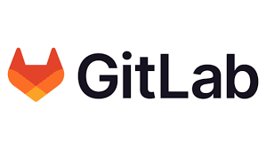
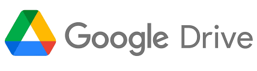

# 👋 Hello, my name is Renat!
 

# 💫 About Me:
🔭 I’m currently working as a backend developer on the student project Studoko 

📌 Currently based in Moscow, Russia
 

## 📚 Education:
- __School number 93__ "Physics and Mathematics Lyceum, Math Class", 2015-2022
- __MIPT__ "Phystech School Of Applied Mathematics And Computer Science", 2022-2026
- __T-Education__ "Backend-development in Scala", 2025-2026
 

## 🌐 Socials:
<table align="center" cellspacing="0" cellpadding="0" border="0">
  <tr>
    <td>
      
    </td>
    <td>
      
    </td>
  </tr>
</table>
 

# 💻 Tech Stack:

  <code></code>
	<code></code>
	<code></code>
	<code></code>
  	<code></code>
  	<code></code>
	<code></code>
  	<code></code>
	<code></code>
	<code></code>

 

## 👨‍💻 API:

